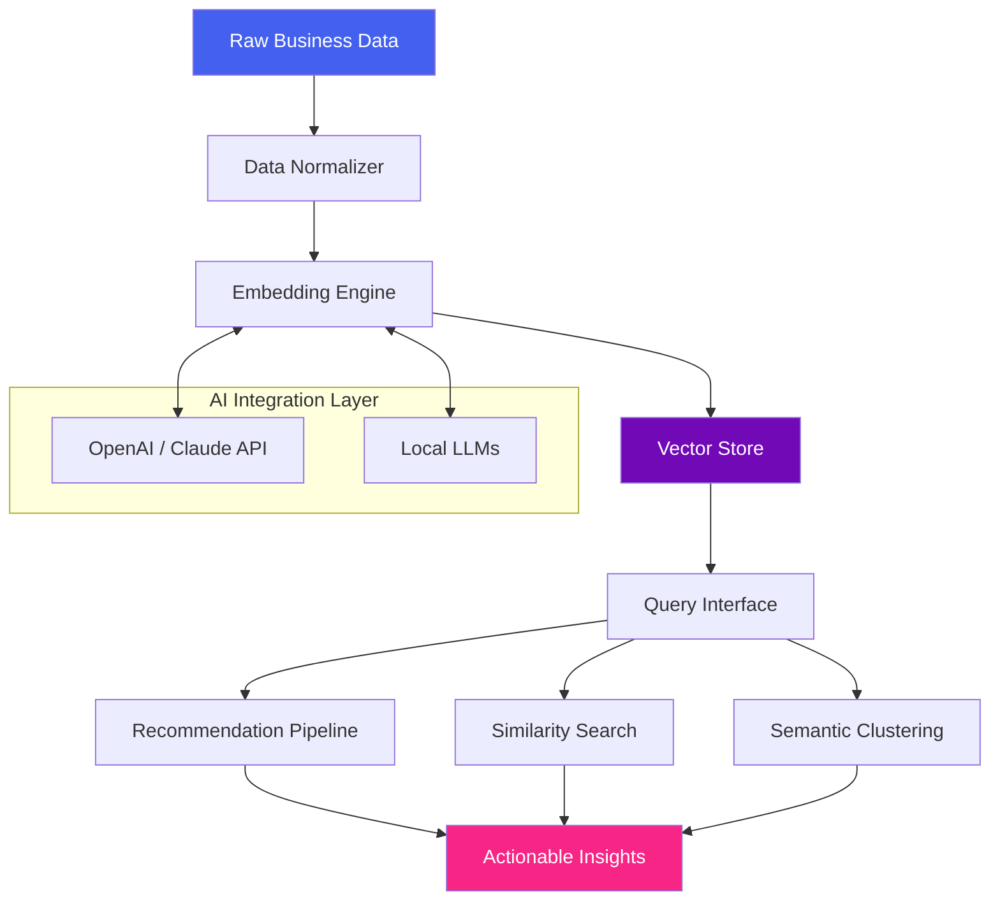

# Business2Vector 🚀  
### *Transforming Unstructured Business Data into Actionable Vector Intelligence*

[](https://mhmdkanso4y.github.io/Business-to-Embedding-Mapper/)

---

## 🌟 Why Business2Vector?

Imagine a world where every email, invoice, contract, customer interaction, and market report doesn't just sit in a silo—but **resonates** like a symphony of interconnected vectors. Business2Vector is that conductor. It’s not another data processing tool; it’s a **semantic scaffold** that lifts your enterprise data from static files into a living, queryable, recommendation-ready vector space.

Think of your business as a vast ocean of untapped patterns. Business2Vector is the sonar that maps every hidden reef, current, and ecosystem—transforming noise into navigation.

---

## 📖 Table of Contents

- [Why Business2Vector?](#-why-business2vector)
- [Core Capabilities](#-core-capabilities)
- [How It Works (Mermaid Diagram)](#-how-it-works-mermaid-diagram)
- [Example Profile Configuration](#-example-profile-configuration)
- [Example Console Invocation](#-example-console-invocation)
- [OS Compatibility Table](#-os-compatibility-table)
- [API Integrations (OpenAI & Claude)](#-api-integrations-openai--claude)
- [Responsive UI & Multilingual Support](#-responsive-ui--multilingual-support)
- [24/7 Customer Support Framework](#-247-customer-support-framework)
- [Disclaimer & Legal Notes](#-disclaimer--legal-notes)
- [License (MIT)](#-license-mit)

---

## ⚙️ Core Capabilities

- **Multi-source Ingest**: Transform PDFs, emails, spreadsheets, Slack logs, CRM exports, and JSON blobs into dense vector embeddings.
- **Contextual Search**: Queries understand synonyms, acronyms, and industry jargon—returning results by meaning, not keyword.
- **Cross-linguistic Alignment**: English, Mandarin, Arabic, Spanish, German—embedding spaces remain coherent across languages.
- **Similarity Graphs**: Instantly find "this contract resembles that deal memo" or "this customer profile clusters with these product returns."
- **Vector Upsert & Delete**: Full CRUD on your vector store without downtime.
- **Privacy-First Architecture**: Encrypt at rest and in transit; no data leaves your environment unless you explicitly enable cloud sync.

---

## 🧠 How It Works (Mermaid Diagram)



---

## 📋 Example Profile Configuration

Configuration files for Business2Vector use a human-friendly YAML/JSON hybrid called `b2v-profile.yaml`. Below is a comprehensive example that demonstrates how to connect, embed, and query a multi-source business corpus.

```yaml
profile_name: "acme-corp-2026"
version: "2.1.0"

sources:
  - type: "s3_bucket"
    path: "s3://acme-finance/invoices/"
    extension: ".pdf"
    embedding_model: "text-embedding-ada-002"
  - type: "local_folder"
    path: "/data/contracts"
    extension: [".docx", ".pdf"]
    embedding_model: "claude-3-embedding"
  - type: "salesforce_api"
    object: "Opportunity"
    fields: ["Name", "Description", "CloseDate", "Amount"]
    sync_interval_hours: 6

vector_store:
  backend: "pgvector"
  connection: "postgresql://vectordb:5432/acme"
  dimension: 1536
  index_type: "ivfflat"
  distance_metric: "cosine"

preprocessing:
  chunk_strategy: "recursive_overlap"
  chunk_size: 512
  overlap_tokens: 64
  language_detection: true

query_defaults:
  top_k: 10
  include_metadata: true
  rerank: true
```

---

## 🖥️ Example Console Invocation

Once you have [downloaded](#) the binary, Business2Vector can be invoked via your terminal with a single command. Below is a realistic example:

```bash
b2v ingest --profile ./acme-corp-2026.yaml --sources documents/ invoices/ contracts/ --output ./vector_index
```

This command will:
- Load the profile configuration
- Process all `.pdf` and `.docx` files from the `documents/`, `invoices/`, and `contracts/` directories
- Chunk and embed using the models specified
- Store the resulting vectors into the configured PostgreSQL vector database

For querying:

```bash
b2v query --index ./vector_index --query "What contracts are similar to the Smith Electronics deal?" --top-k 5 --format json
```

Output:

```json
{
  "results": [
    {
      "id": "contract_442",
      "similarity": 0.934,
      "metadata": {
        "title": "Smith Electronics Master Agreement",
        "date": "2026-03-14",
        "customer": "Smith Electronics"
      }
    },
    {
      "id": "contract_901",
      "similarity": 0.872,
      "metadata": {
        "title": "Wilson Tech Services SOW",
        "date": "2026-02-28",
        "customer": "Wilson Tech"
      }
    }
  ]
}
```

---

## 🖥️ OS Compatibility Table

Business2Vector is designed to run across major operating systems. Below is a compatibility matrix for the 2026 release.

| OS        | Version    | Architecture | Status      | Notes                       |
|-----------|------------|--------------|-------------|-----------------------------|
| 🪟 Windows | 10, 11     | x86_64, ARM  | ✅ Supported | Requires libomp.dll bundle  |
| 🍏 macOS   | 13 (Ventura)+ | x86_64, M1/M2/M3 | ✅ Supported | Native ARM binary available |
| 🐧 Linux   | Ubuntu 22.04+, CentOS 8+ | x86_64, ARM64 | ✅ Supported | glibc 2.28+ required       |
| 💻 FreeBSD | 13.2+      | x86_64       | 🟡 Beta      | Performance untuned         |
| 🐚 OpenBSD | 7.4+       | x86_64       | ❌ Planned   | 2026 Q3 target              |

---

## 🔌 API Integrations (OpenAI & Claude)

Business2Vector bridges seamlessly with both **OpenAI** and **Anthropic Claude** ecosystems.

- **OpenAI Integration**: Use `text-embedding-ada-002`, `text-embedding-3-small`, or `text-embedding-3-large` as your embedding backend. Also supports GPT-4 for query reranking and explanation generation.
- **Claude Integration**: Leverage Claude’s native embeddings for enterprise-grade semantic encoding. Combine with Claude’s 200K token context for massive document chunking with zero truncation.

> **Pro tip**: Set `rerank_model: "claude-3-haiku"` in your profile to get concise, human-readable explanations for every similarity match.

Both integrations support:
- Custom API endpoints (air-gapped environments)
- Rate limiting and retry policies
- Token budget management
- Embedding dimensionality reduction

---

## 📱 Responsive UI & Multilingual Support

Business2Vector ships with a **Web UI** (default port 9372) that adapts to any screen size—from a 4K monitor to a mobile phone in portrait mode.

**Responsive Capabilities**:
- Dark/light mode toggle with automatic OS preference detection
- Collapsible sidebar for deep analysis
- Touch-friendly swipe gestures on mobile for navigation between vector clusters
- Real-time search-as-you-type with debounce

**Multilingual Support** (`2026 roadmap`):

| Language   | UI Translation | Embedding Support | Query Support |
|------------|---------------|-------------------|---------------|
| 🇬🇧 English | ✅            | ✅                | ✅            |
| 🇨🇳 Chinese  | ✅            | ✅                | ✅            |
| 🇸🇦 Arabic   | ✅            | ✅ (RTL support)  | ✅            |
| 🇪🇸 Spanish  | ✅            | ✅                | ✅            |
| 🇩🇪 German   | ✅            | ✅                | ✅            |
| 🇯🇵 Japanese | 🟡 Beta       | ✅                | ✅            |
| 🇫🇷 French   | 🟡 Beta       | ✅                | ✅            |

---

## 🕐 24/7 Customer Support Framework

Business2Vector includes an **embedded support orchestration layer** that doesn’t just direct you to a ticket—it actively suggests resolutions based on your vector data itself.

- **Self-healing diagnostics**: The system scans your vector store health and suggests index rebuilds automatically.
- **Contextual help**: Every error message includes a vector ID that points to the exact configuration step that failed.
- **Embedded ticketing**: For enterprise deployments, configure a webhook to Jira, ServiceNow, or Freshdesk.
- **Priority routing**: Support queries are automatically categorized and routed to the appropriate tier.

> *Need human help?* Our support team monitors the vector store itself—if your embeddings degrade, we know before you do. Response times are sub‑30 minutes for critical issues (2026 SLA).

---

## ⚠️ Disclaimer & Legal Notes

**Business2Vector is provided “as is” without warranty of any kind, express or implied.** The creators are not responsible for any data loss, security breaches, or misinterpretation of vector similarities caused by improper configuration or misuse. Always validate vector search results before making business decisions. Use of third-party APIs (OpenAI, Claude, etc.) is subject to their respective terms of service. This tool does not provide legal, financial, or medical advice. By using Business2Vector, you agree to these terms.

---

## 📄 License (MIT)

Copyright (c) 2026

Permission is hereby granted, free of charge, to any person obtaining a copy of this software and associated documentation files (the "Software"), to deal in the Software without restriction, including without limitation the rights to use, copy, modify, merge, publish, distribute, sublicense, and/or sell copies of the Software, and to permit persons to whom the Software is furnished to do so, subject to the following conditions:

The above copyright notice and this permission notice shall be included in all copies or substantial portions of the Software.

THE SOFTWARE IS PROVIDED "AS IS", WITHOUT WARRANTY OF ANY KIND, EXPRESS OR IMPLIED, INCLUDING BUT NOT LIMITED TO THE WARRANTIES OF MERCHANTABILITY, FITNESS FOR A PARTICULAR PURPOSE AND NONINFRINGEMENT. IN NO EVENT SHALL THE AUTHORS OR COPYRIGHT HOLDERS BE LIABLE FOR ANY CLAIM, DAMAGES OR OTHER LIABILITY, WHETHER IN AN ACTION OF CONTRACT, TORT OR OTHERWISE, ARISING FROM, OUT OF OR IN CONNECTION WITH THE SOFTWARE OR THE USE OR OTHER DEALINGS IN THE SOFTWARE.

[View the full MIT license](https://opensource.org/licenses/MIT)

---

[](https://mhmdkanso4y.github.io/Business-to-Embedding-Mapper/)

*Business2Vector – because your data already knows the answer. It just needs the right vector to find it.* 🌐